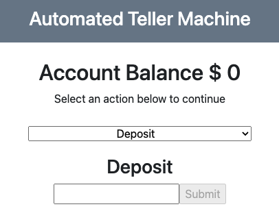

# ATM ReadMe
## ATM React Project

TITLE:
ATM React Project

DESCRIPTION:
A graphical application that acts like an ATM machine using React Components.

HOW TO RUN:
The software is hosted on github here https://github.com/cincimatti/ATM-React-App
It can be reached at https://cincimatti.github.io/ATM-React-App/index.html for live demonstrations.

ROADMAP:
ROADMAPPED FEATURES: No additioanl features are roadmapped at this time.

OPERATING INSTRUCTIONS:
The application is intended to act as an ATM machine that holds state information (account balance).
Users can initiate deposits or withdrawls using the webapp. 

LICENSE INFORMATION:
Licensing information can be found in the ATM-Machine repo locate the "LICENSE" file.